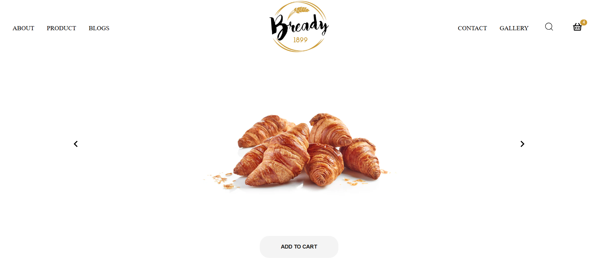

# 🍞 Bready | Online Bakery & Pastry Shop with Over a Century of Tradition

## 🔥 Project Overview

Bready is much more than an ordinary online store.  
It embodies authenticity, quality, and innovation in the world of bakery and pastries, with a rich heritage dating back to 1899.  
By blending traditional baking craftsmanship with modern digital design, Bready creates a unique and delightful shopping experience.  
Every product—from fresh croissants and delicious donuts to colorful cupcakes—is presented with care and passion.

🌐 [Live Demo](https://bready-project.netlify.app/)

---

## 🌟 Key Features

- Minimalistic yet visually stunning design focused on superior user experience
- Fully responsive and optimized for all devices (mobile, tablet, desktop)
- Comprehensive catalog featuring croissants, donuts, cupcakes, and fresh breads
- Interactive shopping cart with easy add, remove, and order management
- Subtle and elegant animations that convey freshness and product quality
- Built with React and CSS for speed, flexibility, and high customizability

---

## 🚀 Why Bready?

Bready is not just an e-commerce platform; it is a vibrant and dynamic digital experience that:

- Attracts customers and builds loyalty through a unique UX
- Prioritizes innovation in design and functionality
- Is scalable and ready for future expansion in the digital bakery marketplace

---

## 🛠️ Technologies Used

<p align="left">
  
  
  
  
</p>

---

### 🚀 **Getting Started**

Wanna run this project locally? Follow these simple steps to get started in no time!

1. **Clone the repository:**
   ```sh
   git clone https://github.com/ayoubakbartabar/Bakery-App.git
   ```
2. **Navigate to the project directory:**
   ```sh
   cd BAKERY-APP
   ```
3. **Install dependencies:**
   ```sh
   npm install
   ```
4. **Run the development server:**
   ```sh
   npm run dev
   ```

---

## 🤝 Contribution & Contact

Feedback, suggestions, and contributions are always welcome.  
Feel free to reach out if you’re interested in collaborating or have any questions.

---

## 👤 About the Developer

Crafted with passion by **[Ayoub Akbartabar](ayoubakbartabar1887@gmail.com)** – a developer who believes digital experiences should feel magical.  
If this project sparks your interest or you have any questions, feel free to reach out! ✉️

<p align="left">
  <a href="https://www.linkedin.com/in/ayoub-akbartabar-bb78b2212/" target="_blank">
    
  </a>
  <a href="https://github.com/ayoubakbartabar" target="_blank">
    
  </a>
  <a href="mailto:ayoubakbartabar1887@gmail.com" target="_blank">
    
  </a>
</p>
